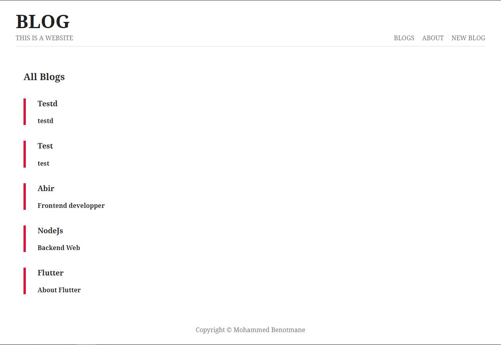
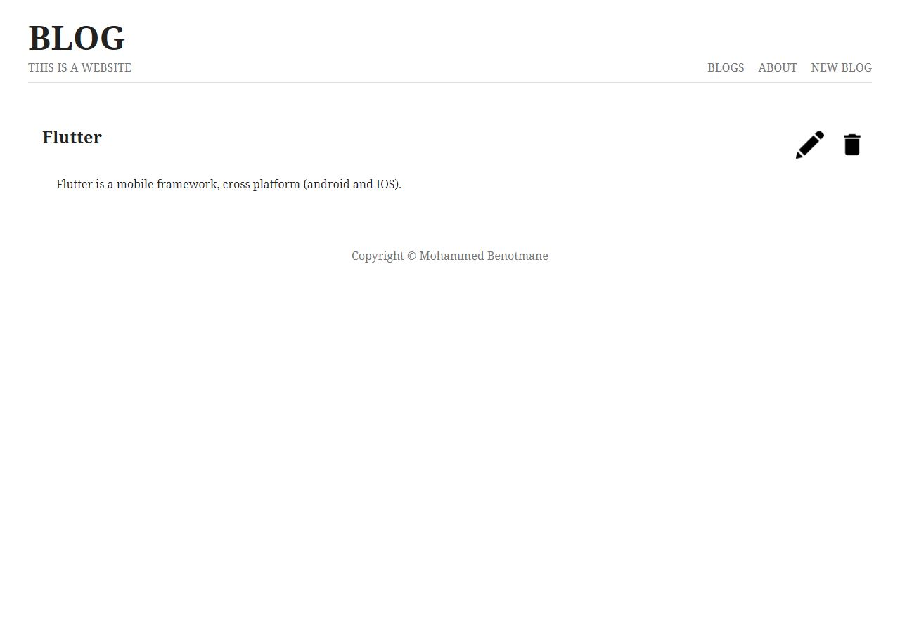
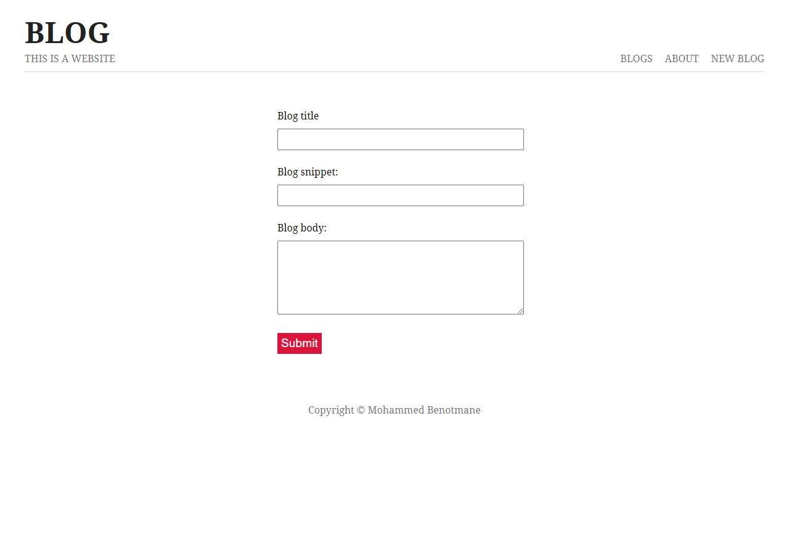

# Blog-with-Node.js

## Description:

This is a Blog using NodeJs.

## ScreenShots:

  

## Tools & languages:
* VS Code (IDE)
* JavaScript (logic)
* Postman (Api testing tool)

## Contribution:
Feel free to fork this project and add whatever you like. If you have any suggestions or any comments please feel free to contact me or to open an issue.

## Team:
[Jetlighters](https://github.com/JetLightStudio) having fun.

## Special thanks:
Tutorial [Link](https://www.youtube.com/watch?v=zb3Qk8SG5Ms&list=PL4cUxeGkcC9jsz4LDYc6kv3ymONOKxwBU)
